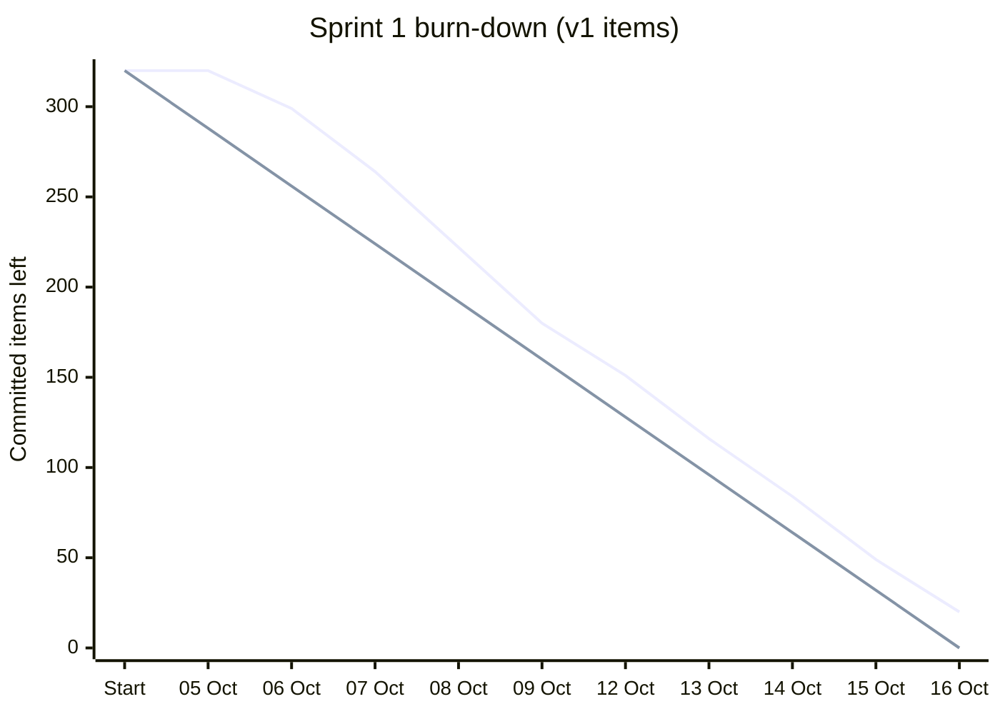
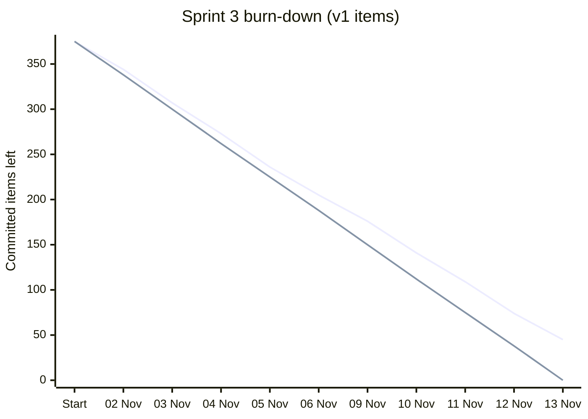
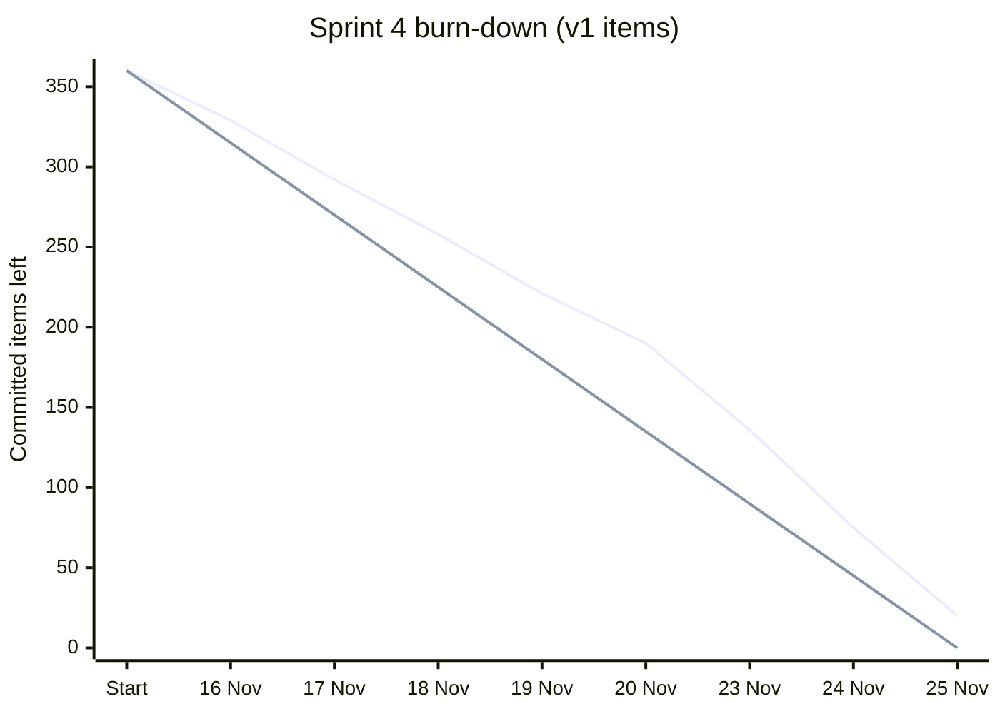
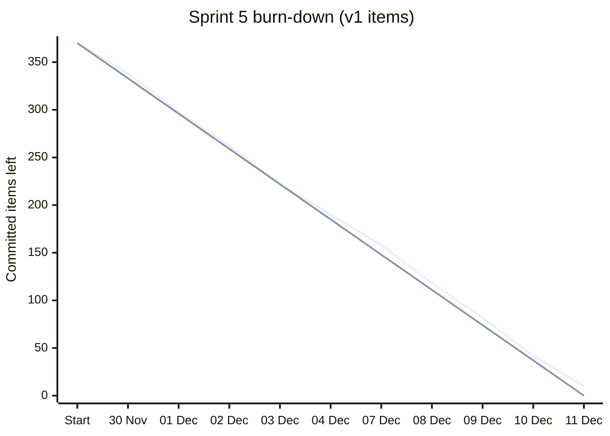
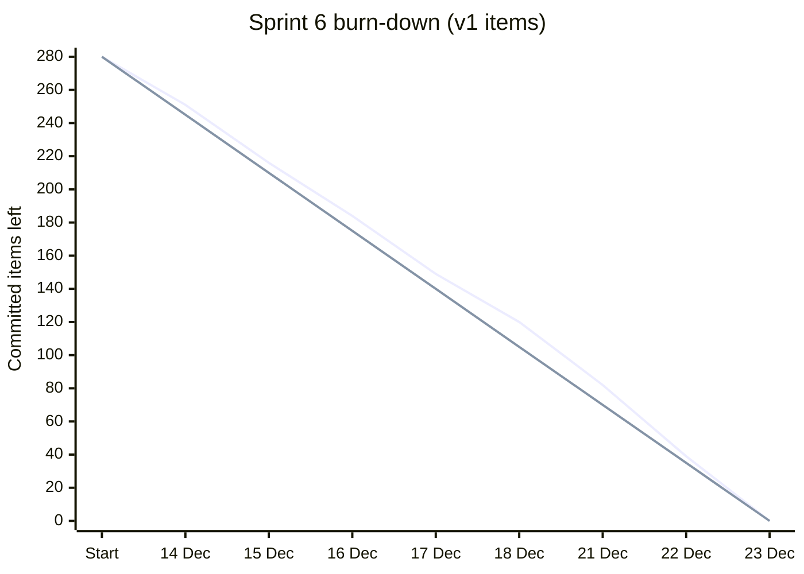
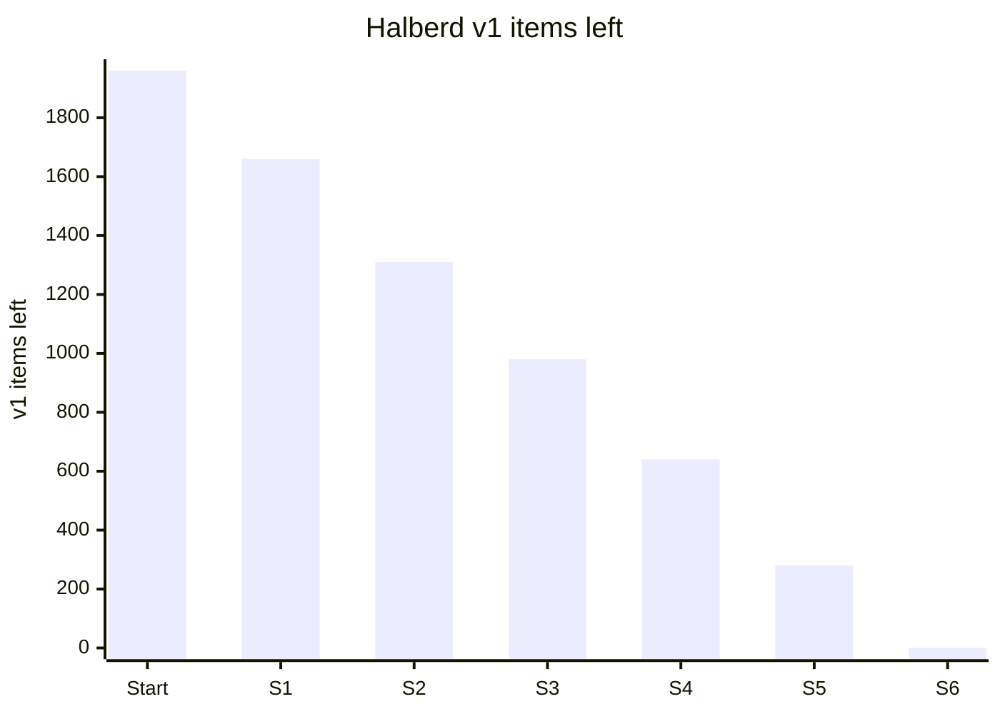

# Status metrics: keywords and phrases

Frame: "I put the system model under a DevSecOps pipeline for IAMD."

Report the outcome and the count. Every [N] comes from the collection method for its metric in
Appendix A. There are 26 metrics, A to Z. Appendix B gives the data format for the dashboard. Appendix C runs Halberd through 12 weeks. Appendix D gives its daily standups and sprint burn-downs.

## Coverage

A. **% under configuration control**
   - "[N]% of the IAMD architecture is now under configuration control as text, up from [N]%."
   - "[N] elements entered configuration control this sprint."
B. **Segments gated**
   - "[N] of [N] segments are now gated on every merge."
   - "[N] segments joined the pipeline this sprint."
C. **Requirements linked**
   - "[N] of [N] DOORS requirements are now linked to model elements."
   - "[N] requirements were linked this week."
D. **Elements in baseline**
   - "Baseline [N] holds [N] elements, up [N] from the last baseline."
   - "[N] new elements entered the baseline this sprint, all linted 0/0."

## Quality

E. **Lint errors / warnings**
   - "The model lints [N] errors / [N] warnings across [N] elements."
   - "All [N] merges this sprint passed at 0/0."
F. **Orphan requirements**
   - "There are [N] orphan requirements in [segment]. Last week there were [N]."
   - "[N] orphans remain, and each has an owner."
G. **Unverified requirements**
   - "The trace found [N] requirements with no verification method. They're flagged to their owners."
   - "Unverified requirements dropped from [N] to [N]."
H. **Interface mismatches caught at merge**
   - "The pipeline caught [N] interface mismatches before review. Under the old process, they would have been found at integration."
   - "[N] mismatches were caught at merge this sprint, and [N] reached integration."
I. **Trace completeness**
   - "[N]% of requirements are traced satisfy-to-verify end to end."
   - "[N] of [N] segments have a complete trace."

## Time and cost

J. **Labor hours saved**
   - "Interface tables are now generated, not hand-built. That saves about [N] labor hours per baseline."
   - "That's [N] hours saved this quarter on [document type]."
K. **Regeneration time**
   - "ICD views now regenerate in [N] minutes. The old process took [N] days."
   - "A full document set rebuilds from the model in [N] minutes."
L. **Documents generated, not hand-built**
   - "[N] of [N] [document type] now come straight from the model."
   - "Drawing plates now come from model views. That's [N] plates this sprint."
M. **Hand edits**
   - "Generated documents needed [N] hand edits this sprint."
   - "Hand edits to [document type] went from [N] per baseline to [N]."
N. **Lead time**
   - "A model change now reaches a reviewed baseline in [N] days. Before, it took [N] days."
   - "Median lead time from merge request to merge is [N] hours."

## Digital thread

O. **Parameters sourced from the model**
   - "[N] of [N] sim parameters now come from the model, not spreadsheets."
   - "[N] parameters moved from spreadsheets to the model this sprint."
P. **Sim runs pinned to a baseline**
   - "[N] of [N] sim runs this sprint name the exact baseline that fed them."
   - "[N] sim results in this review trace to baseline [N]."

## Risk retired

Q. **Uncovered zone crossings**
   - "There are [N] uncovered zone crossings across [N] interfaces."
   - "[N] interfaces cross a trust zone, and each one has a security requirement or it can't merge."
R. **Unmitigated threats**
   - "All [N] recorded threats are traced to a mitigation and a requirement."
   - "Unmitigated threats went from [N] to [N]."
S. **Reproducible baselines**
   - "Baseline [N] is tagged and reproducible. Any sim run can name the exact model that fed it."
   - "[N] baselines tagged to date, and [N] of them rebuild identically."
T. **Drift (model vs. documents)**
   - "Drift between the model and the ICDs is [N] lines, because they regenerate on every change."
   - "Drift checks found [N] discrepancies in legacy documents. They're flagged for correction."

## Flow (agile)

U. **Merges per sprint**
   - "[N] model changes merged this sprint, all gated."
   - "Merge volume went from [N] to [N] per sprint."
V. **Change failure rate**
   - "[N]% of merges needed a fix-forward, against a target of under [N]%."
   - "[N] merges were reverted this sprint."
W. **Time to restore**
   - "A broken gate was restored in [N] hours."
   - "Median time to green after a failure is [N] minutes."
X. **Done %**
   - "This sprint, [N]% of committed items are done."
   - "[N] of [N] [segment] items are done."
Y. **Blocked days**
   - "There were [N] blocked days this sprint, all waiting on [runner/access/license]."
   - "Blocked days dropped from [N] to [N] after [fix]."
Z. **Active contributors**
   - "[N] of [N] engineers merged a model change this sprint."
   - "[N] engineers have merged at least one model change to date."

## Round-robin template

"[N]% of [segment] is now under the pipeline (A). [N] new traces (C). [N] interface mismatches caught at merge (H). Next: [segment]."

---

# Appendix A: collecting each [N]

Assumptions: the model is SysML v2 text under `model/` in Git, with one top-level package per
segment. Requirements carry a `doorsId` attribute. Baselines are tagged `baseline-*`. The lint
prints a summary line, and gate failures are logged to `.gate.log` with an error code. Adjust
paths and patterns to match the repo. `PAT` is the element pattern defined in A.

**A. % under configuration control**
- Values: elements in v2 text ÷ elements in the legacy v1 model × 100, plus the previous report's %.
- v2 count: take the element count from the lint summary. Fallback:
  `PAT='^\s*(part|port|interface|connection|requirement|action|item|attribute)( def)?\b'`
  `grep -rhE "$PAT" model --include=*.sysml | wc -l`
- v1 count: count once from the legacy XMI export, restricted to in-scope types:
  `grep -cE 'xmi:type="uml:(Class|Port|Property|Connector|Activity)"' legacy.xmi`
- Freeze the v1 count as the denominator, and record the date and filter you used.

**B. Segments gated**
- Total: `ls -d model/*/ | wc -l`
- Gated: the paths covered by the CI lint job (or the pre-commit hook path list):
  `grep -c '^model/' CODEOWNERS`
- Joined this sprint: the difference from last sprint's count.

**C. Requirements linked**
- Total: the DOORS module object count from the ReqIF export:
  `grep -c '<SPEC-OBJECT ' export.reqif`
- Linked: `grep -rhoE 'doorsId *= *"[^"]+"' model | sort -u | wc -l`

**D. Elements in baseline**
- Run A's pattern against a tag: `git grep -hE "$PAT" baseline-2 -- 'model/*.sysml' | wc -l`
- The increase is the count at this tag minus the count at the previous tag.

**E. Lint errors / warnings**
- Errors, warnings and elements: read the lint summary line on `main`.
- Merges at 0/0: `git log --merges --first-parent main --since=<sprint start> --oneline | wc -l`
  Because the gate refuses anything above 0/0, every merge counted here passed at 0/0.

**F. Orphan requirements** (requirements that nothing satisfies)
- Prefer the trace report. Fallback:
  `comm -23 <(grep -rhoE 'requirement def \w+' model | awk '{print $3}' | sort -u) <(grep -rhoE 'satisfy \w+' model | awk '{print $2}' | sort -u) | wc -l`

**G. Unverified requirements**
- Same as F, with `verify` in place of `satisfy`.

**H. Interface mismatches caught at merge**
- `grep -c '<interface error code>' .gate.log` for the sprint window, or the count of CI jobs failed with that code.
- Reached integration: interface defects logged at integration in the defect tracker.

**I. Trace completeness**
- Requirements that are both satisfied and verified ÷ total requirements × 100, using F and G.
- A segment counts as complete when its F and G are both 0.

**J. Labor hours saved**
- Manual hours per artifact × artifacts generated per baseline (L).
- Get manual hours from charge records for the last hand-built version, or from the document owner's estimate.
- Write down the source. This one is an estimate, so expect someone to ask.

**K. Regeneration time**
- Generated: the CI job duration, or `time make docs`.
- Old process: the schedule or charge records for the last manual update.

**L. Documents generated**
- Generated: `ls generated/ | wc -l` (or the count by document type).
- Total: the document list (CDRL or the program document tree).

**M. Hand edits**
- Commits that touch released documents but aren't generator output:
  `git log --since=<sprint start> --oneline -- released/ | grep -vc 'generated'`
- Or count redlines on the release review.

**N. Lead time**
- From merge request open to merge, from the CI server's MR history.
- Git-only fallback: the time from the branch's first commit to its merge commit,
  `git log --format=%ci` on each.
- Report the median. Get the before value from the old change-board cycle records.

**O. Parameters sourced from the model**
- Generated: the parameter count in the generated parameter files,
  `grep -chE '^\s*#define|=' generated/params/* | awk '{s+=$1} END {print s}'`
- Total: the sim input inventory (every parameter the sims read), counted once and frozen like A's denominator.

**P. Sim runs pinned to a baseline**
- Pinned: runs whose provenance file names a baseline tag and model hash,
  `grep -l 'model_baseline=' runs/*/provenance.txt | wc -l`
- Total: `ls -d runs/*/ | wc -l` for the sprint window.

**Q. Uncovered zone crossings**
- From the security section of the lint report: interfaces whose ends sit in different zones, and of those, how many lack a satisfied security requirement.

**R. Unmitigated threats**
- Total: `grep -rc '@Threat' model | awk -F: '{s+=$2} END {print s}'`
- Unmitigated: the security lint's mitigation-closure count.

**S. Reproducible baselines**
- Tagged: `git tag -l 'baseline-*' | wc -l`
- Reproducible: check out each tag, rebuild, and compare `sha256sum` of the generated outputs with the hashes recorded at tagging.

**T. Drift**
- Diff the generated tables against the legacy tables:
  `diff <(sort generated/icd.csv) <(sort legacy/icd.csv) | grep -c '^[<>]'`

**U. Merges per sprint**
- `git log --merges --first-parent main --since=<start> --until=<end> --oneline | wc -l`

**V. Change failure rate**
- Reverts and fix-forwards ÷ merges (U) × 100:
  `git log --first-parent main --since=<start> --oneline | grep -ciE '^\w+ (revert|fix-forward)'`
- Adopt a commit prefix convention so this count works.

**W. Time to restore**
- The time from the first red pipeline on `main` to the next green one, from the CI history.
- Fallback: the timestamps in `.gate.log`.

**X. Done %**
- Items done ÷ items committed at sprint start × 100, from the tracker.

**Y. Blocked days**
- The sum of days each item carried the blocked flag, from the tracker. Group the total by blocker.

**Z. Active contributors**
- Contributors: `git log --first-parent main --since=<start> --format=%an -- model | sort -u | wc -l`
- Total: the team roster for the model.

# Appendix B: dashboard data

`status-dashboard.html` reads one JSON object, and `collect.py report` writes it as `dashboard.json`. Paste it into the dashboard's data panel and select Apply.
Each metric is keyed by its letter. `v` is the current value, `prev` the last report, and `hist`
the trend line. Other keys fill the matching phrase.

```json
{
  "sprint": "Sprint 14", "baseline": "baseline-2", "date": "2026-10-02",
  "m": {
    "A": { "v": 62, "prev": 48, "hist": [20, 31, 40, 48, 55, 62] },
    "B": { "v": 4, "total": 7, "prev": 3 },
    "E": { "v": 0, "w": 0, "elements": 2440 },
    "Y": { "v": 4, "prev": 9, "blocker": "a shared runner" }
  }
}
```

Extra keys by metric: B, C, L, O, P, Q, R, S and Z use `total`. D uses `tag`. E uses `w` and
`elements`. H uses `reached`. K and N use `old`. T uses `legacy`. Y uses `blocker`.

# Appendix C: Halberd, 12 weeks

Halberd is fictional and notional, and so is every number here. The scenario: Halberd's legacy
SysML v1 model holds 1,960 in-scope items across its 7 organizations, and 1,450 DOORS
requirements. I port it to SysML v2 text, one segment at a time, starting the week of
5 October 2026. Two-week sprints. A baseline is tagged every 4 weeks.

I work a burn-down list. The status meeting hears the alphabet.

## Translation key

| What I did (my list) | What moves | What I say |
|---|---|---|
| Ported a v1 item | A, D, E | Under configuration control, gated at 0/0 |
| Finished a segment | B, Z | Segment gated; its owner merges |
| Re-linked a DOORS requirement | C, F, G, I | Requirements linked; orphans and unverified surfaced; trace % |
| Ported an interface | H, Q, T | Mismatches caught at merge; zone crossings covered; drift found |
| Replaced a hand-built table or view with a generated one | J, K, L, M | Hours saved; regeneration time; documents generated; hand edits |
| Tagged a baseline | D, S, N | Baseline size; reproducible; lead time |
| Wired a sim input to the model | O, P | Parameters sourced; runs pinned to a baseline |
| Ported a threat or mitigation | R | Unmitigated threats |
| Closed a sprint | U, V, W, X, Y | Merges; change failure; time to restore; done %; blocked days |

## My burn-down

| Week of | Segment worked | v1 items ported | Remaining |
|---|---|---|---|
| 1 (5 Oct) | Pipeline setup; E (Systems Engineering & Integration) | 140 | 1,820 |
| 2 (12 Oct) | E | 160 | 1,660 |
| 3 (19 Oct) | E done; V (Interceptor Development) started | 170 | 1,490 |
| 4 (26 Oct) | V | 180 | 1,310 |
| 5 (2 Nov) | V done; B (Battle Management & Fire Control) started | 170 | 1,140 |
| 6 (9 Nov) | B | 160 | 980 |
| 7 (16 Nov) | B done; T (Test & Evaluation) started | 170 | 810 |
| 8 (23 Nov) | T done | 170 | 640 |
| 9 (30 Nov) | G (Government Program Office) done | 180 | 460 |
| 10 (7 Dec) | M (Manufacturing & Production) | 180 | 280 |
| 11 (14 Dec) | M done; L (Logistics & Sustainment) started | 160 | 120 |
| 12 (21 Dec) | L done | 120 | 0 |

## Metric snapshot

All 26 metrics, end of each week.

| | Metric | W1 | W2 | W3 | W4 | W5 | W6 | W7 | W8 | W9 | W10 | W11 | W12 |
|---|---|---|---|---|---|---|---|---|---|---|---|---|---|
| A | % under configuration control | 7 | 15 | 24 | 33 | 42 | 50 | 59 | 67 | 77 | 86 | 94 | 100 |
| B | Segments gated (of 7) | 0 | 0 | 1 | 1 | 2 | 2 | 3 | 4 | 5 | 5 | 6 | 7 |
| C | Requirements linked (of 1,450) | 0 | 90 | 210 | 340 | 480 | 610 | 760 | 900 | 1,050 | 1,210 | 1,360 | 1,450 |
| D | Elements in latest baseline | — | — | — | 650 | 650 | 650 | 650 | 1,320 | 1,320 | 1,320 | 1,320 | 1,960 |
| E | Lint errors / warnings | 0/0 | 0/0 | 0/0 | 0/0 | 0/0 | 0/0 | 0/0 | 0/0 | 0/0 | 0/0 | 0/0 | 0/0 |
| F | Orphan requirements | 0 | 12 | 41 | 66 | 58 | 47 | 52 | 39 | 28 | 17 | 8 | 3 |
| G | Unverified requirements | 0 | 20 | 55 | 80 | 74 | 63 | 60 | 48 | 35 | 22 | 11 | 4 |
| H | Interface mismatches caught (to date) | 0 | 4 | 11 | 16 | 25 | 31 | 39 | 42 | 46 | 48 | 49 | 49 |
| I | Trace completeness % | 0 | 4 | 8 | 13 | 24 | 34 | 45 | 56 | 68 | 81 | 92 | 99 |
| J | Labor hours saved per baseline | — | — | — | 4 | 4 | 8 | 11 | 15 | 23 | 30 | 38 | 45 |
| K | Regeneration time (min) | — | — | — | 9 | 9 | 8 | 8 | 7 | 7 | 6 | 6 | 6 |
| L | Documents generated (of 12) | 0 | 0 | 0 | 1 | 1 | 2 | 3 | 4 | 6 | 8 | 10 | 12 |
| M | Hand edits | — | — | — | 0 | 0 | 0 | 0 | 0 | 0 | 0 | 0 | 0 |
| N | Lead time (days) | 12 | 11 | 10 | 9 | 8 | 7 | 6 | 5 | 4 | 4 | 3 | 3 |
| O | Parameters sourced (of 64) | — | — | — | — | — | — | — | 64 | 64 | 64 | 64 | 64 |
| P | Sim runs pinned (to date) | — | — | — | — | — | — | — | 12 of 12 | 15 of 15 | 19 of 19 | 21 of 21 | 21 of 21 |
| Q | Uncovered zone crossings | 0 of 0 | 2 of 4 | 3 of 7 | 2 of 9 | 4 of 13 | 1 of 15 | 3 of 19 | 0 of 21 | 1 of 23 | 0 of 25 | 1 of 27 | 0 of 27 |
| R | Unmitigated threats | 0 of 0 | 0 of 1 | 1 of 3 | 2 of 4 | 3 of 6 | 3 of 7 | 3 of 8 | 3 of 10 | 2 of 12 | 1 of 12 | 1 of 12 | 0 of 12 |
| S | Reproducible baselines | — | — | — | 1 of 1 | 1 of 1 | 1 of 1 | 1 of 1 | 2 of 2 | 2 of 2 | 2 of 2 | 2 of 2 | 3 of 3 |
| T | Legacy ICD discrepancies open | — | — | — | — | — | 47 | 40 | 31 | 22 | 14 | 6 | 0 |
| U | Merges per sprint | — | 21 | — | 26 | — | 24 | — | 22 | — | 28 | — | 25 |
| V | Change failure rate % | — | 10 | — | 8 | — | 4 | — | 5 | — | 4 | — | 4 |
| W | Time to restore (h) | — | — | — | — | — | — | — | — | — | — | 2 | — |
| X | Done % (sprint) | — | 94 | — | 97 | — | 88 | — | 94 | — | 97 | — | 100 |
| Y | Blocked days (sprint) | — | 0 | — | 0 | — | 3 | — | 0 | — | 0 | — | 0 |
| Z | Active contributors (of 7) | 0 | 0 | 1 | 1 | 2 | 2 | 3 | 4 | 5 | 5 | 6 | 7 |

A dash means the metric doesn't exist yet that week (no baseline, no generated document, no incident).
U, V, X and Y are sprint metrics, so they report on sprint-close weeks only.

F and G rise first, because porting surfaces gaps the v1 model hid, and then they fall as owners
close them. That curve is the story to tell.

## Week by week

**Week 1**
- My list: Repo, pre-commit gate and CI lint job set up. Ported 140 E items.
- Status: "The Halberd model is now under the pipeline. 7% of the architecture is under configuration control (A), and every merge is gated at 0 errors / 0 warnings (E). Next: Systems Engineering & Integration."

**Week 2**
- My list: Ported 160 E items. Imported the first DOORS module.
- Status: "15% under configuration control (A). 90 of 1,450 DOORS requirements are linked to model elements (C). The pipeline caught 4 interface mismatches before review (H). 21 model changes merged this sprint, all gated (U)."

**Week 3**
- My list: E finished. Started V.
- Status: "1 of 7 segments is now gated on every merge (B). The trace found 55 requirements with no verification method, and they're flagged to their owners (G). 41 requirements have nothing satisfying them yet (F)."

**Week 4**
- My list: Ported 180 V items. Replaced the hand-built interface table with a generated one. Tagged baseline-1.
- Status: "Baseline 1 holds 650 elements (D), and it rebuilds identically (S). 1 of 12 program documents now comes straight from the model (L), with 0 hand edits (M)."

**Week 5**
- My list: V finished. Started B. Lost 3 days waiting on a runner.
- Status: "2 of 7 segments gated (B). 4 of 13 interfaces crossing a trust zone lack a security requirement, and they can't merge until they're covered (Q). There were 3 blocked days, all waiting on a shared runner (Y)."

**Week 6**
- My list: Ported 160 B items. Generated the first ICD view and diffed it against the legacy ICD.
- Status: "50% under configuration control (A). Drift checks found 47 discrepancies in the legacy ICDs, flagged for correction (T). Orphan requirements are down from 66 to 47 (F). 88% of committed items are done this sprint (X)."

**Week 7**
- My list: B finished. Started T.
- Status: "3 of 7 segments gated (B). 39 interface mismatches have been caught at merge to date, and 0 reached integration (H). 3 of 7 segment owners now merge their own changes (Z)."

**Week 8**
- My list: T finished. Wired the T2 pre-flight prediction inputs to the model. Tagged baseline-2.
- Status: "Baseline 2 holds 1,320 elements (D). 64 of 64 pre-flight prediction parameters now come from the model, not spreadsheets (O), and 12 of 12 prediction runs name the baseline that fed them (P). There are 0 uncovered zone crossings across 21 interfaces (Q)."

**Week 9**
- My list: G finished, including the milestone review packages.
- Status: "5 of 7 segments gated (B). 68% of requirements are traced satisfy-to-verify (I). A model change now reaches a reviewed baseline in 4 days; the old change board cycle took 19 (N). 2 of 12 recorded threats lack a traced mitigation (R)."

**Week 10**
- My list: Ported 180 M items.
- Status: "86% under configuration control (A). 1,210 of 1,450 requirements linked (C). 8 of 12 program documents come straight from the model (L), which saves about 30 labor hours per baseline (J)."

**Week 11**
- My list: M finished. Started L. The gate broke on a parser update and was fixed the same morning.
- Status: "6 of 7 segments gated (B). Unverified requirements are down to 11 (G). ICD views regenerate in 6 minutes; the old process took 4 days (K). A broken gate was restored in 2 hours (W)."

**Week 12**
- My list: L finished. The v1 list is at 0. Tagged baseline-3.
- Status: "100% of the Halberd architecture is under configuration control (A), and all 7 segments are gated (B). Baseline 3 holds 1,960 elements and rebuilds identically (D, S). 99% of requirements are traced end to end, and the last 7 are with their owners (I, F, G). 4% of merges this sprint needed a fix-forward (V)."

All 26 letters appear at least once across the 12 weeks.

# Appendix D: Halberd daily standups and sprint burn-downs

This follows Appendix C, day by day: the same notional 1,960 v1 items and 1,450 DOORS
requirements, every one ported by the end of week 12. Thanksgiving (26 and 27 November) and
24 and 25 December are holidays, so weeks 8 and 12 have 3 working days.

The "Ported" and "Left" columns are my list. The standup is what I say. Each standup answers the
usual three questions (yesterday, today, blockers), in the alphabet.

## Daily standups


### Sprint 1 (weeks 1 and 2)


**Week 1**

| Day | Ported | Left | Yesterday | Today | Blockers |
|---|---|---|---|---|---|
| Mon 05 Oct | 0 | 1,960 | Nothing yet; the pipeline goes up today. | Setting up the repo, the pre-commit gate and the CI lint job. | None. |
| Tue 06 Oct | 21 | 1,939 | The pipeline is up: pre-commit gate and CI lint job, 0/0 to merge (E). | Continuing Systems Engineering & Integration. | None. |
| Wed 07 Oct | 35 | 1,904 | 21 more elements under configuration control, now 1% (A), all merged at 0/0 (E). | More of Systems Engineering & Integration goes under configuration control today. | None. |
| Thu 08 Oct | 42 | 1,862 | 35 more elements under configuration control, now 3% (A), all merged at 0/0 (E). | Bringing more of Systems Engineering & Integration under the pipeline. | None. |
| Fri 09 Oct | 42 | 1,820 | 42 more elements under configuration control, now 5% (A), all merged at 0/0 (E). | Continuing Systems Engineering & Integration. | None. |

**Week 2**

| Day | Ported | Left | Yesterday | Today | Blockers |
|---|---|---|---|---|---|
| Mon 12 Oct | 29 | 1,791 | 42 more elements under configuration control, now 7% (A), all merged at 0/0 (E). | Importing the first DOORS module. | None. |
| Tue 13 Oct | 35 | 1,756 | 29 more elements under configuration control, now 9% (A), all merged at 0/0 (E). The first DOORS module is in, and requirements are now linking to model elements (C). 2 orphan and 4 unverified requirements, flagged to owners (F, G). | Bringing more of Systems Engineering & Integration under the pipeline. | None. |
| Wed 14 Oct | 32 | 1,724 | 35 more elements under configuration control, now 10% (A), all merged at 0/0 (E). 1 of 2 zone-crossing interfaces still need a security requirement (Q). | Continuing Systems Engineering & Integration. | None. |
| Thu 15 Oct | 35 | 1,689 | 32 more elements under configuration control, now 12% (A), all merged at 0/0 (E). 54 of 1,450 DOORS requirements linked (C). | More of Systems Engineering & Integration goes under configuration control today. | None. |
| Fri 16 Oct | 29 | 1,660 | 35 more elements under configuration control, now 14% (A), all merged at 0/0 (E). 3 interface mismatches caught at merge to date, 0 reached integration (H). | Bringing more of Systems Engineering & Integration under the pipeline. | None. |

### Sprint 2 (weeks 3 and 4)


**Week 3**

| Day | Ported | Left | Yesterday | Today | Blockers |
|---|---|---|---|---|---|
| Mon 19 Oct | 31 | 1,629 | 29 more elements under configuration control, now 15% (A), all merged at 0/0 (E). 12 orphan and 20 unverified requirements, flagged to owners (F, G). | Continuing Systems Engineering & Integration. | None. |
| Tue 20 Oct | 37 | 1,592 | 31 more elements under configuration control, now 17% (A), all merged at 0/0 (E). 2 of 5 zone-crossing interfaces still need a security requirement (Q). | Finishing Systems Engineering & Integration; it should be gated by end of day. | None. |
| Wed 21 Oct | 34 | 1,558 | 37 more elements under configuration control, now 19% (A), all merged at 0/0 (E). Systems Engineering & Integration is now gated on every merge: 1 of 7 segments (B). 138 of 1,450 DOORS requirements linked (C). | Bringing more of Interceptor Development under the pipeline. | None. |
| Thu 22 Oct | 37 | 1,521 | 34 more elements under configuration control, now 21% (A), all merged at 0/0 (E). 8 interface mismatches caught at merge to date, 0 reached integration (H). | Continuing Interceptor Development. | None. |
| Fri 23 Oct | 31 | 1,490 | 37 more elements under configuration control, now 22% (A), all merged at 0/0 (E). 36 orphan and 49 unverified requirements, flagged to owners (F, G). | More of Interceptor Development goes under configuration control today. | None. |

**Week 4**

| Day | Ported | Left | Yesterday | Today | Blockers |
|---|---|---|---|---|---|
| Mon 26 Oct | 32 | 1,458 | 31 more elements under configuration control, now 24% (A), all merged at 0/0 (E). 3 of 7 zone-crossing interfaces still need a security requirement (Q). | Bringing more of Interceptor Development under the pipeline. | None. |
| Tue 27 Oct | 40 | 1,418 | 32 more elements under configuration control, now 26% (A), all merged at 0/0 (E). 233 of 1,450 DOORS requirements linked (C). | Continuing Interceptor Development. | None. |
| Wed 28 Oct | 36 | 1,382 | 40 more elements under configuration control, now 28% (A), all merged at 0/0 (E). 13 interface mismatches caught at merge to date, 0 reached integration (H). | More of Interceptor Development goes under configuration control today. | None. |
| Thu 29 Oct | 40 | 1,342 | 36 more elements under configuration control, now 29% (A), all merged at 0/0 (E). 56 orphan and 70 unverified requirements, flagged to owners (F, G). | Generating the interface table from the model. | None. |
| Fri 30 Oct | 32 | 1,310 | 40 more elements under configuration control, now 32% (A), all merged at 0/0 (E). The interface table is now generated from the model: 1 of 12 program documents (L), 0 hand edits (M). 2 of 9 zone-crossing interfaces still need a security requirement (Q). | Tagging baseline 1. | None. |

### Sprint 3 (weeks 5 and 6)


**Week 5**

| Day | Ported | Left | Yesterday | Today | Blockers |
|---|---|---|---|---|---|
| Mon 02 Nov | 31 | 1,279 | 32 more elements under configuration control, now 33% (A), all merged at 0/0 (E). Baseline 1 is tagged: 650 elements (D), and it rebuilds identically (S). 340 of 1,450 DOORS requirements linked (C). | More of Interceptor Development goes under configuration control today. | None. |
| Tue 03 Nov | 37 | 1,242 | 31 more elements under configuration control, now 35% (A), all merged at 0/0 (E). 18 interface mismatches caught at merge to date, 0 reached integration (H). | Finishing Interceptor Development; it should be gated by end of day. | None. |
| Wed 04 Nov | 34 | 1,208 | 37 more elements under configuration control, now 37% (A), all merged at 0/0 (E). Interceptor Development is now gated on every merge: 2 of 7 segments (B). 63 orphan and 78 unverified requirements, flagged to owners (F, G). | Continuing Battle Management & Fire Control. | Waiting on a shared runner. Gating locally with the pre-commit hook meanwhile (Y). |
| Thu 05 Nov | 37 | 1,171 | 34 more elements under configuration control, now 38% (A), all merged at 0/0 (E). | More of Battle Management & Fire Control goes under configuration control today. | Still waiting on the shared runner (Y). |
| Fri 06 Nov | 31 | 1,140 | 37 more elements under configuration control, now 40% (A), all merged at 0/0 (E). 454 of 1,450 DOORS requirements linked (C). | Bringing more of Battle Management & Fire Control under the pipeline. | Runner still pending; asked for it again (Y). |

**Week 6**

| Day | Ported | Left | Yesterday | Today | Blockers |
|---|---|---|---|---|---|
| Mon 09 Nov | 29 | 1,111 | 31 more elements under configuration control, now 42% (A), all merged at 0/0 (E). 25 interface mismatches caught at merge to date, 0 reached integration (H). The shared runner is live. | Continuing Battle Management & Fire Control. | None. |
| Tue 10 Nov | 35 | 1,076 | 29 more elements under configuration control, now 43% (A), all merged at 0/0 (E). 56 orphan and 72 unverified requirements, flagged to owners (F, G). | More of Battle Management & Fire Control goes under configuration control today. | None. |
| Wed 11 Nov | 32 | 1,044 | 35 more elements under configuration control, now 45% (A), all merged at 0/0 (E). 3 of 14 zone-crossing interfaces still need a security requirement (Q). | Generating the first ICD view and diffing it against the legacy ICD. | None. |
| Thu 12 Nov | 35 | 1,009 | 32 more elements under configuration control, now 47% (A), all merged at 0/0 (E). Drift checks found 47 discrepancies in the legacy ICDs, flagged for correction (T). 558 of 1,450 DOORS requirements linked (C). | Continuing Battle Management & Fire Control. | None. |
| Fri 13 Nov | 29 | 980 | 35 more elements under configuration control, now 49% (A), all merged at 0/0 (E). 30 interface mismatches caught at merge to date, 0 reached integration (H). | More of Battle Management & Fire Control goes under configuration control today. | None. |

### Sprint 4 (weeks 7 and 8)


**Week 7**

| Day | Ported | Left | Yesterday | Today | Blockers |
|---|---|---|---|---|---|
| Mon 16 Nov | 31 | 949 | 29 more elements under configuration control, now 50% (A), all merged at 0/0 (E). 47 orphan and 63 unverified requirements, flagged to owners (F, G). | Bringing more of Battle Management & Fire Control under the pipeline. | None. |
| Tue 17 Nov | 37 | 912 | 31 more elements under configuration control, now 52% (A), all merged at 0/0 (E). 1 of 16 zone-crossing interfaces still need a security requirement (Q). | Finishing Battle Management & Fire Control; it should be gated by end of day. | None. |
| Wed 18 Nov | 34 | 878 | 37 more elements under configuration control, now 53% (A), all merged at 0/0 (E). Battle Management & Fire Control is now gated on every merge: 3 of 7 segments (B). 3 of 7 segment owners now merge their own changes (Z). 670 of 1,450 DOORS requirements linked (C). | More of Test & Evaluation goes under configuration control today. | None. |
| Thu 19 Nov | 37 | 841 | 34 more elements under configuration control, now 55% (A), all merged at 0/0 (E). 36 interface mismatches caught at merge to date, 0 reached integration (H). | Bringing more of Test & Evaluation under the pipeline. | None. |
| Fri 20 Nov | 31 | 810 | 37 more elements under configuration control, now 57% (A), all merged at 0/0 (E). 51 orphan and 61 unverified requirements, flagged to owners (F, G). | Continuing Test & Evaluation. | None. |

**Week 8**

| Day | Ported | Left | Yesterday | Today | Blockers |
|---|---|---|---|---|---|
| Mon 23 Nov | 54 | 756 | 31 more elements under configuration control, now 59% (A), all merged at 0/0 (E). 3 of 19 zone-crossing interfaces still need a security requirement (Q). | More of Test & Evaluation goes under configuration control today. | None. |
| Tue 24 Nov | 61 | 695 | 54 more elements under configuration control, now 61% (A), all merged at 0/0 (E). 804 of 1,450 DOORS requirements linked (C). | Wiring the T2 pre-flight prediction inputs to the model. | None. |
| Wed 25 Nov | 55 | 640 | 61 more elements under configuration control, now 65% (A), all merged at 0/0 (E). 64 of 64 pre-flight prediction parameters now come from the model (O), and 12 of 12 prediction runs name their baseline (P). 41 interface mismatches caught at merge to date, 0 reached integration (H). | Tagging baseline 2 before the holiday. | None. |

### Sprint 5 (weeks 9 and 10)


**Week 9**

| Day | Ported | Left | Yesterday | Today | Blockers |
|---|---|---|---|---|---|
| Mon 30 Nov | 32 | 608 | 55 more elements under configuration control, now 67% (A), all merged at 0/0 (E). Test & Evaluation is now gated on every merge: 4 of 7 segments (B). 4 of 7 segment owners now merge their own changes (Z). Baseline 2 is tagged: 1,320 elements (D), rebuilds identically (S). 39 orphan and 48 unverified requirements, flagged to owners (F, G). | More of Government Program Office goes under configuration control today. | None. |
| Tue 01 Dec | 40 | 568 | 32 more elements under configuration control, now 69% (A), all merged at 0/0 (E). | Bringing more of Government Program Office under the pipeline. | None. |
| Wed 02 Dec | 36 | 532 | 40 more elements under configuration control, now 71% (A), all merged at 0/0 (E). 960 of 1,450 DOORS requirements linked (C). | Continuing Government Program Office. | None. |
| Thu 03 Dec | 40 | 492 | 36 more elements under configuration control, now 73% (A), all merged at 0/0 (E). | Reviewing threat and mitigation coverage with the ISSM. | None. |
| Fri 04 Dec | 32 | 460 | 40 more elements under configuration control, now 75% (A), all merged at 0/0 (E). 2 of 12 recorded threats lack a traced mitigation (R). 30 orphan and 37 unverified requirements, flagged to owners (F, G). | Measuring lead time on the last 10 merges. | None. |

**Week 10**

| Day | Ported | Left | Yesterday | Today | Blockers |
|---|---|---|---|---|---|
| Mon 07 Dec | 32 | 428 | 32 more elements under configuration control, now 77% (A), all merged at 0/0 (E). Government Program Office is now gated on every merge: 5 of 7 segments (B). 5 of 7 segment owners now merge their own changes (Z). A model change now reaches a reviewed baseline in 4 days; the old change board cycle took 19 (N). | Continuing Manufacturing & Production. | None. |
| Tue 08 Dec | 40 | 388 | 32 more elements under configuration control, now 78% (A), all merged at 0/0 (E). 1,078 of 1,450 DOORS requirements linked (C). | More of Manufacturing & Production goes under configuration control today. | None. |
| Wed 09 Dec | 36 | 352 | 40 more elements under configuration control, now 80% (A), all merged at 0/0 (E). 47 interface mismatches caught at merge to date, 0 reached integration (H). | Generating the remaining ICD views. | None. |
| Thu 10 Dec | 40 | 312 | 36 more elements under configuration control, now 82% (A), all merged at 0/0 (E). 8 of 12 program documents now come straight from the model (L), about 30 labor hours saved per baseline (J). 21 orphan and 27 unverified requirements, flagged to owners (F, G). | Continuing Manufacturing & Production. | None. |
| Fri 11 Dec | 32 | 280 | 40 more elements under configuration control, now 84% (A), all merged at 0/0 (E). 0 of 25 zone-crossing interfaces still need a security requirement (Q). | More of Manufacturing & Production goes under configuration control today. | None. |

### Sprint 6 (weeks 11 and 12)


**Week 11**

| Day | Ported | Left | Yesterday | Today | Blockers |
|---|---|---|---|---|---|
| Mon 14 Dec | 29 | 251 | 32 more elements under configuration control, now 86% (A), all merged at 0/0 (E). 1,210 of 1,450 DOORS requirements linked (C). | Bringing more of Manufacturing & Production under the pipeline. | None. |
| Tue 15 Dec | 35 | 216 | 29 more elements under configuration control, now 87% (A), all merged at 0/0 (E). | Finishing Manufacturing & Production; it should be gated by end of day. | None. |
| Wed 16 Dec | 32 | 184 | 35 more elements under configuration control, now 89% (A), all merged at 0/0 (E). Manufacturing & Production is now gated on every merge: 6 of 7 segments (B). 6 of 7 segment owners now merge their own changes (Z). 13 orphan and 18 unverified requirements, flagged to owners (F, G). | Rebuilding the gate after this morning's parser update. | None. |
| Thu 17 Dec | 35 | 149 | 32 more elements under configuration control, now 91% (A), all merged at 0/0 (E). The gate broke on a parser update and was restored in 2 hours (W). ICD views regenerate in 6 minutes (K). | Bringing more of Logistics & Sustainment under the pipeline. | None. |
| Fri 18 Dec | 29 | 120 | 35 more elements under configuration control, now 92% (A), all merged at 0/0 (E). 1,333 of 1,450 DOORS requirements linked (C). | Continuing Logistics & Sustainment. | None. |

**Week 12**

| Day | Ported | Left | Yesterday | Today | Blockers |
|---|---|---|---|---|---|
| Mon 21 Dec | 38 | 82 | 29 more elements under configuration control, now 94% (A), all merged at 0/0 (E). | More of Logistics & Sustainment goes under configuration control today. | None. |
| Tue 22 Dec | 43 | 39 | 38 more elements under configuration control, now 96% (A), all merged at 0/0 (E). 6 orphan and 9 unverified requirements, flagged to owners (F, G). | Bringing more of Logistics & Sustainment under the pipeline. | None. |
| Wed 23 Dec | 39 | 0 | 43 more elements under configuration control, now 98% (A), all merged at 0/0 (E). | Tagging baseline 3. | None. |


## Sprint burn-downs

Each sprint commits a set of v1 items, including anything carried over. "Left" is committed items
not yet ported at the end of each day. "Ideal" is the straight line from the commitment to 0. In
each chart, the first line is the actual and the second is the ideal.


### Sprint 1: weeks 1 and 2

Committed 320. Done 300. Carried over 20. Done % 94 (X).



| Day | Start | 05 Oct | 06 Oct | 07 Oct | 08 Oct | 09 Oct | 12 Oct | 13 Oct | 14 Oct | 15 Oct | 16 Oct |
|---|---|---|---|---|---|---|---|---|---|---|---|
| Left | 320 | 320 | 299 | 264 | 222 | 180 | 151 | 116 | 84 | 49 | 20 |
| Ideal | 320 | 288 | 256 | 224 | 192 | 160 | 128 | 96 | 64 | 32 | 0 |


### Sprint 2: weeks 3 and 4

Committed 360. Done 350. Carried over 10. Done % 97 (X).


| Day | Start | 19 Oct | 20 Oct | 21 Oct | 22 Oct | 23 Oct | 26 Oct | 27 Oct | 28 Oct | 29 Oct | 30 Oct |
|---|---|---|---|---|---|---|---|---|---|---|---|
| Left | 360 | 329 | 292 | 258 | 221 | 190 | 158 | 118 | 82 | 42 | 10 |
| Ideal | 360 | 324 | 288 | 252 | 216 | 180 | 144 | 108 | 72 | 36 | 0 |


### Sprint 3: weeks 5 and 6

Committed 375. Done 330. Carried over 45. Done % 88 (X).



| Day | Start | 02 Nov | 03 Nov | 04 Nov | 05 Nov | 06 Nov | 09 Nov | 10 Nov | 11 Nov | 12 Nov | 13 Nov |
|---|---|---|---|---|---|---|---|---|---|---|---|
| Left | 375 | 344 | 307 | 273 | 236 | 205 | 176 | 141 | 109 | 74 | 45 |
| Ideal | 375 | 338 | 300 | 262 | 225 | 188 | 150 | 112 | 75 | 38 | 0 |


### Sprint 4: weeks 7 and 8

Committed 360. Done 340. Carried over 20. Done % 94 (X).



| Day | Start | 16 Nov | 17 Nov | 18 Nov | 19 Nov | 20 Nov | 23 Nov | 24 Nov | 25 Nov |
|---|---|---|---|---|---|---|---|---|---|
| Left | 360 | 329 | 292 | 258 | 221 | 190 | 136 | 75 | 20 |
| Ideal | 360 | 315 | 270 | 225 | 180 | 135 | 90 | 45 | 0 |


### Sprint 5: weeks 9 and 10

Committed 370. Done 360. Carried over 10. Done % 97 (X).



| Day | Start | 30 Nov | 01 Dec | 02 Dec | 03 Dec | 04 Dec | 07 Dec | 08 Dec | 09 Dec | 10 Dec | 11 Dec |
|---|---|---|---|---|---|---|---|---|---|---|---|
| Left | 370 | 338 | 298 | 262 | 222 | 190 | 158 | 118 | 82 | 42 | 10 |
| Ideal | 370 | 333 | 296 | 259 | 222 | 185 | 148 | 111 | 74 | 37 | 0 |


### Sprint 6: weeks 11 and 12

Committed 280. Done 280. Carried over 0. Done % 100 (X).



| Day | Start | 14 Dec | 15 Dec | 16 Dec | 17 Dec | 18 Dec | 21 Dec | 22 Dec | 23 Dec |
|---|---|---|---|---|---|---|---|---|---|
| Left | 280 | 251 | 216 | 184 | 149 | 120 | 82 | 39 | 0 |
| Ideal | 280 | 245 | 210 | 175 | 140 | 105 | 70 | 35 | 0 |


## Release burn-down

The whole v1 list, sprint by sprint.



| Sprint | Committed | Done | Carried over | Done % (X) | v1 items left | Under configuration control (A) |
|---|---|---|---|---|---|---|
| 1 | 320 | 300 | 20 | 94 | 1,660 | 15% |
| 2 | 360 | 350 | 10 | 97 | 1,310 | 33% |
| 3 | 375 | 330 | 45 | 88 | 980 | 50% |
| 4 | 360 | 340 | 20 | 94 | 640 | 67% |
| 5 | 370 | 360 | 10 | 97 | 280 | 86% |
| 6 | 280 | 280 | 0 | 100 | 0 | 100% |
